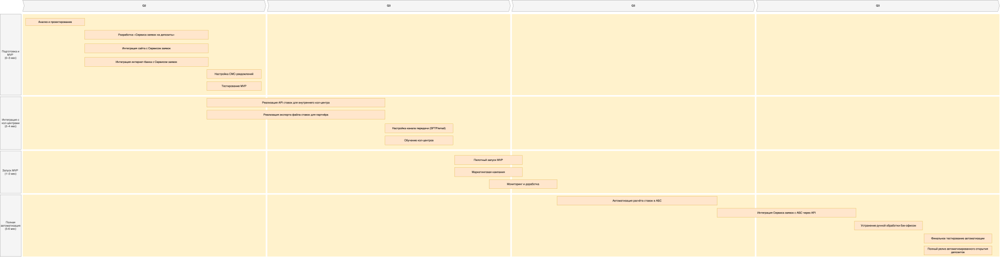

## Задание 1

### Схема IT ландшафта

### Схема интеграции приложений 

### Описание кредитного процесса
В текущем кредитном процессе банка «Стандарт» клиент может подать заявку только в отделении: сотрудник фронт-офиса создаёт её в АБС, откуда раз в сутки заявки пакетно выгружаются в Кредитный конвейер (Camunda). Там менеджер бэк-офиса инициирует скоринг - система на Python запрашивает актуальные данные из Бюро кредитных историй онлайн, но сведения из АБС (балансы, история платежей) поступают с суточной задержкой. Решение принимается вручную или автоматически, после чего раз в день одобренные кредиты синхронизируются обратно в АБС для зачисления средств и отправки SMS-уведомления. Весь цикл занимает до нескольких дней, а онлайн-каналы (сайт, интернет-банк) не участвуют в процессе.

Файлы схем находятся в [директории задания](./Task1/)

## Задание 2

| Код | Требования                         | Комментарий  |
|-----|------------------------------------|--------------|
| F | Клиент может подать заявку на депозит через сайт, указав ФИО и номер телефона. | MVP: заявка создаётся в системе кол-центра; триггер для звонка менеджера. |
| F | Клиент может подать заявку на депозит через интернет-банк, указав счёт, сумму и подтвердив СМС-кодом. | Требуется интеграция с СМС-шлюзом. СМС будет использоваться для подтверждения операции (как цифровая подпись) |
| F | Клиент может подать заявку на кредит через сайт (с паспортными данными - с мгновенным решением на основе БКИ). | Решение формируется через систему скоринга, используя только внешние данные. |
| F | Клиент может подать заявку на кредит через интернет-банк с предодобренным предложением. | Предложение основано на ранее выполненных скорингах; повторный скоринг - упрощённый. |
| F | Заявки с сайта и интернет-банка должны сохраняться в единой системе учёта, доступной для сотрудников бэк-офиса и фронт-офиса. | Обеспечить сквозную нумерацию и статусы заявок (например, в АБС или новом сервисе). |
| F | При подаче заявки на сайте/в интернет-банке клиент получает СМС-уведомление о статусе (подтверждение, одобрение, приглашение в отделение). | Использовать существующий СМС-шлюз. |
| F | Сотрудник в отделении должен видеть и продолжать работу с заявкой, начатой клиентом онлайн. | Требуется единый идентификатор заявки и синхронизация между каналами. |
| U | Интерфейсы сайта и интернет-банка должны соответствовать корпоративной дизайн-системе (цвета, шрифты, элементы). | Обеспечивает узнаваемость и доверие; снижает когнитивную нагрузку. |
| U | Все операции (загрузка списка депозитов/кредитов, подача заявки) должны отвечать за < 1 секунды. | Устранение текущих задержек (>1 сек) при загрузке справочников. |
| U | Процесс подачи заявки должен занимать не более 3 шагов и не требовать избыточных данных. | Повышает конверсию, особенно для новых клиентов. |
| R | Системы (сайт, интернет-банк, сервисы обработки заявок) должны быть доступны 99,9% времени (24/7). | Соответствует банковским стандартам; критично для цифровых каналов. |
| R | При сбое основного ЦОД - автоматическое переключение на резервный ЦОД без потери данных. | Уже есть резервный ЦОД; требуется настроить failover и репликацию. |
| R | Персональные и финансовые данные клиентов должны передаваться по защищённому каналу (TLS 1.2+). | Требование регулятора (ЦБ РФ) и PCI DSS; применимо ко всем внешним интерфейсам. |
| P | Система должна выдерживать пиковую нагрузку до 1000 одновременных пользователей в интернет-банке. | Оценка на перспективу привлечения молодой аудитории. |
| P | Загрузка справочников (ставки по депозитам/кредитам) должна происходить за ≤ 300 мс. | Требуется кэширование (Redis или in-memory) вместо прямого запроса к АБС. |
| P | Система кредитного скоринга не должна нагружаться предварительными расчётами для всех посетителей сайта. | Ограничение: скоринг только после ввода паспортных данных. |
| S | Все новые компоненты должны использовать существующие технологии: MS SQL, Oracle, Java, .NET, Python. | Минимизация рисков, обучение, поддержка. |
| S | Новые сервисы должны быть совместимы с возможностью перехода на микросервисную архитектуру. | Подготовка к будущей модернизации интернет-банка. |
| S | Должна быть разработана техническая документация (API, архитектура, схемы данных) для новых модулей. | Обеспечивает поддерживаемость и передачу знаний. |
| +R | Запрещена прямая интеграция интернет-банка с базой данных АБС (только через API или промежуточный слой). | Защита АБС от перегрузки; соблюдение принципа loose coupling. |
| +R | Новые сервисы должны поддерживать горизонтальное масштабирование (кроме АБС). | АБС масштабируется только вертикально - это ограничение. |
| +R | При использовании очередей сообщений - предпочтительно Kafka (с учётом будущей совместимости). | Хотя текущий интернет-банк не поддерживает Kafka, новый функционал может использовать её через адаптер. |
| +R | Хранение ставок по депозитам должно быть централизовано (в АБС). | Устранение Excel-файлов; обеспечение актуальности и безопасности данных. |
| +R | Все новые сервисы должны логировать события в соответствии с внутренними стандартами банка. | Необходимо для аудита, мониторинга и расследования инцидентов. |

## Задание 3

### **Название задачи:** Открытие депозитов онлайн для MVP

### **Автор:** Архитектор цифровой трансформации
### **Дата:** 29.01.2026
### **Функциональные требования**

**№**|**Действующие лица или системы**|**Use Case**|**Описание**|
| :-: | :- | :- | :- |
|1|Клиент (новый)|Подать заявку на депозит через сайт|Клиент указывает ФИО и номер телефона. Заявка сохраняется, триггер для звонка из кол-центра.|
|2|Клиент (существующий)|Подать заявку на депозит через интернет-банк|Клиент выбирает счёт, сумму, видит персонализированную ставку, подтверждает СМС-кодом.|
|3|Оператор кол-центра|Обработать заявку с сайта|Получает уведомление в системе кол-центра, звонит клиенту, может предложить особые условия.|
|4|Менеджер бэк-офиса (депозиты)|Обработать заявку на депозит|Просматривает заявку в АБС, подтверждает/корректирует ставку, открывает депозит.|
|5|Система|Отправить СМС-уведомления|После подтверждения ставки и открытия депозита - клиент получает SMS.|
|6|Сотрудник отделения|Продолжить работу с онлайн-заявкой|Если клиент пришёл в отделение после подачи заявки онлайн - используется та же заявка.|

### **Нефункциональные требования**

|**№**|**Требование**|
| :-: | :- |
|1|Все внешние каналы (сайт, интернет-банк) должны использовать TLS 1.2+ для защиты данных.|
|2|Время отклика по операциям (загрузка ставок, подача заявки) ≤ 1 секунда.|
|3|Системы должны быть доступны 99,9% времени (24/7).|
|4|Запрещена прямая интеграция с БД АБС - только через API или промежуточный слой.|
|5|Новые компоненты должны использовать существующие технологии (MS SQL, Oracle, Java, .NET, Python).|
|6|АБС не должна подвергаться дополнительной нагрузке; все онлайн-операции - асинхронно или через кэш.|
|7|Интерфейсы должны соответствовать корпоративной дизайн-системе.|

### **Решение**
Приведите диаграммы контекста и контейнеров в модели C4. Опишите там основные компоненты и интеграции всех элементов решения. 

Также опишите, какой логикой вы руководствовались в ходе принятия решений и выбора технологий. Не забывайте, что необходимо учесть все функциональные и нефункциональные требования.

### Диаграмма контекста

### Диаграмма контейнеров

Учитывая:
- Перегруженность АБС,
- Отсутствие централизованного хранения ставок,
- Необходимость избежать доработок ядра интернет-банка,
- Требования к безопасности и отказоустойчивости,

предлагается ввести новый микросервис «Сервис заявок на депозиты», который будет:
- Приемником заявок с сайта и интернет-банка,
- Хранить актуальные ставки (получаемые из АБС раз в день или через админ-панель),
- Интегрироваться с кол-центром и СМС-шлюзом,
- Передавать заявки в АБС асинхронно (через файл или API-адаптер), не нагружая её в реальном времени.

Это решение позволяет:
- Изолировать АБС от онлайн-нагрузки,
- Использовать существующие возможности сотрудников (Java/Spring Boot - уже есть в команде АБС),
- Подготовить основу для будущей полной автоматизации.

### **Альтернативы**

| Вариант | Описание | Почему отклонён |
|--------|---------|------------------|
| **Прямая интеграция интернет-банка с АБС через API** | Разработка REST API поверх АБС для приёма заявок в реальном времени. | АБС не поддерживает горизонтальное масштабирование; высокий риск перегрузки; команда АБС против онлайн-нагрузки. |
| **Хранение ставок в Excel + ручная загрузка в интернет-банк** | Продолжить текущую практику обмена ставками через Excel-файлы по email. | Нарушает требования к актуальности, безопасности и автоматизации; не масштабируется; создаёт операционные риски. |
| **Полная автоматизация открытия депозита в MVP** | Открытие депозита без участия бэк-офиса сразу после подачи заявки. | Противоречит цели MVP: на первом этапе бизнес требует ручной обработки заявок бэк-офисом для контроля и согласования условий. |

**Недостатки, ограничения, риски**

- Новый микросервис требует DevOps-инфраструктуры (CI/CD, мониторинг).

## Задание 4

### **Название задачи:**  
Обеспечение доступа к актуальным депозитным ставкам для внутреннего и партнёрского кол-центров

### **Автор:**  
Архитектор цифровой трансформации

### **Дата:**  
29 января 2026 г.

### **Функциональные требования**

|**№**|**Действующие лица или системы**|**Use Case**|**Описание**|
| :-: | :- | :- | :- |
|1|Сотрудник внутреннего кол-центра|Получить актуальные ставки по депозитам|Видит список депозитов и ставок в интерфейсе своей системы при работе с клиентом.|
|2|Сотрудник партнёрского кол-центра|Получить актуальные ставки по депозитам|Использует внешнюю CRM; получает ставки из файла, предоставленного банком.|
|3|Система «Сервис заявок на депозиты»|Публиковать актуальные ставки|Формирует и выкладывает файл со ставками не реже 1 раза в день.|
|4|Система внутреннего кол-центра|Загружать ставки из центрального источника|Автоматически или вручную обновляет справочник ставок из API или файла.|
|5|Партнёрский кол-центр|Получать файл со ставками|Загружает файл по согласованному каналу (например, защищённая email-рассылка или SFTP).|

### **Нефункциональные требования**

|**№**|**Требование**|
| :-: | :- |
|1|Актуальность ставок: данные должны обновляться не реже 1 раза в сутки.|
|2|Формат передачи для партнёра - файл (CSV/JSON), без API-интеграции.|
|3|Передача данных должна быть защищена (шифрование при передаче и хранении).|
|4|Решение должно использовать существующие технологии и инфраструктуру банка.|
|5|Минимальное вмешательство в системы кол-центров (особенно партнёрского).|
|6|Файл со ставками должен содержать только публичную информацию (без персональных или конфиденциальных данных).|
|7|Процесс публикации ставок должен быть автоматизирован и логироваться.|

### **Решение**

### Обоснование
Текущий процесс хранения ставок в Excel-файлах ненадёжен и не масштабируем. В рамках MVP по открытию депозитов уже вводится **«Сервис заявок на депозиты»**, который будет хранить актуальные ставки в своей базе (MS SQL или Oracle).  

Мы предлагаем:
- Использовать этот сервис как **единственный источник правды** для ставок.
- Реализовать в нём **задачу экспорта** ставок в формате CSV/JSON.
- Для **внутреннего кол-центра** - предоставить REST API (GET /deposits/rates) с кэшированием.
- Для **партнёрского кол-центра** - генерировать зашифрованный файл и отправлять его по согласованному каналу (например, через защищённую email-рассылку или SFTP).

Это решение:
- Устраняет Excel-файлы,
- Минимизирует изменения в кол-центрах,
- Соответствует ограничениям партнёра,
- Использует уже разрабатываемый компонент.

### Диаграмма контекста

### Диаграмма контейнеров

### **Альтернативы**

| Вариант | Описание | Почему отклонён |
|--------|---------|------------------|
| **Прямая интеграция кол-центров с АБС** | Кол-центры читают ставки напрямую из АБС. | АБС перегружена; нет API; нарушает принцип изоляции бэк-офиса. |

**Недостатки, ограничения, риски**

1. **Задержка обновления** — ставки обновляются раз в сутки → клиент может получить устаревшую информацию утром.  

2. **Ручной импорт файла партнёром** — возможны задержки или ошибки.  

3. **Зависимость от нового сервиса** — если «Сервис заявок» недоступен, кол-центры не получат ставки.  

4. **Безопасность файла** — при передаче по email/SFTP требуется шифрование.  

### Список крупных задач по системам
1. Сервис заявок на депозиты (новый микросервис)  
- Спроектировать и развернуть микросервис на Java/Spring Boot.
- Реализовать хранилище депозитных ставок (MS SQL / Oracle).
- Разработать REST API для приёма заявок от сайта и интернет-банка.
- Реализовать генерацию и публикацию файла со ставками (CSV/JSON) для партнёрского кол-центра.
- Обеспечить шифрование данных при передаче и хранении (TLS, PGP для файлов).
2. Сайт (PHP + React.js)
- Добавить страницу «Депозиты» с отображением списка продуктов и ставок.
- Реализовать форму подачи заявки.
- Интегрировать форму с API «Сервиса заявок на депозиты».
3. Интернет-банк (ASP.NET MVC + MS SQL)
- Добавить раздел «Депозиты» с персонализированными ставками.
- Реализовать форму подачи заявки (выбор счёта, сумма, подтверждение СМС).
- Интегрировать с API «Сервиса заявок на депозиты».
4. Система внутреннего кол-центра (React + Spring Boot)
- Добавить виджет отображения актуальных депозитных ставок в интерфейсе оператора.
- Обеспечить отображение даты актуальности ставок.
5. Партнёрский кол-центр (внешняя CRM)
- Согласовать формат файла (CSV/JSON) и канал передачи (SFTP / защищённый email).
- Автоматизировать ежедневную отправку файла из «Сервиса заявок».
- Предоставить партнёру документацию по формату и процедуре импорта.
6. АБС (Delphi + Oracle)
- Разработать адаптер (файл или легковесный REST) для приёма заявок от «Сервиса заявок».
- Обеспечить отображение онлайн-заявок в рабочем месте менеджера депозитов.
7. СМС-шлюз (интеграция с телеком-оператором)
- Утвердить шаблоны SMS-уведомлений (подтверждение заявки, одобрение ставки, открытие депозита).
- Настроить маршрутизацию уведомлений от «Сервиса заявок» через существующий шлюз.
- Протестировать доставку в пиковые периоды.
8. Инфраструктура и DevOps
- Развернуть CI/CD для нового микросервиса.
- Настроить репликацию между основным и резервным ЦОД.

### Диаграмма Ганта

