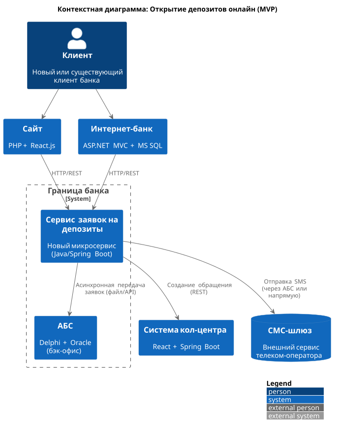
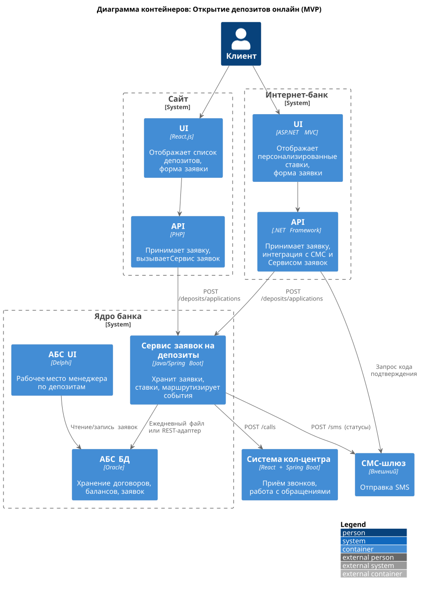

### **Название задачи:** Открытие депозитов онлайн для MVP

### **Автор:** Архитектор цифровой трансформации
### **Дата:** 29.01.2026
### **Функциональные требования**

**№**|**Действующие лица или системы**|**Use Case**|**Описание**|
| :-: | :- | :- | :- |
|1|Клиент (новый)|Подать заявку на депозит через сайт|Клиент указывает ФИО и номер телефона. Заявка сохраняется, триггер для звонка из кол-центра.|
|2|Клиент (существующий)|Подать заявку на депозит через интернет-банк|Клиент выбирает счёт, сумму, видит персонализированную ставку, подтверждает СМС-кодом.|
|3|Оператор кол-центра|Обработать заявку с сайта|Получает уведомление в системе кол-центра, звонит клиенту, может предложить особые условия.|
|4|Менеджер бэк-офиса (депозиты)|Обработать заявку на депозит|Просматривает заявку в АБС, подтверждает/корректирует ставку, открывает депозит.|
|5|Система|Отправить СМС-уведомления|После подтверждения ставки и открытия депозита — клиент получает SMS.|
|6|Сотрудник отделения|Продолжить работу с онлайн-заявкой|Если клиент пришёл в отделение после подачи заявки онлайн — используется та же заявка.|

### **Нефункциональные требования**

|**№**|**Требование**|
| :-: | :- |
|1|Все внешние каналы (сайт, интернет-банк) должны использовать TLS 1.2+ для защиты данных.|
|2|Время отклика по операциям (загрузка ставок, подача заявки) ≤ 1 секунда.|
|3|Системы должны быть доступны 99,9% времени (24/7).|
|4|Запрещена прямая интеграция с БД АБС — только через API или промежуточный слой.|
|5|Новые компоненты должны использовать существующие технологии (MS SQL, Oracle, Java, .NET, Python).|
|6|АБС не должна подвергаться дополнительной нагрузке; все онлайн-операции — асинхронно или через кэш.|
|7|Интерфейсы должны соответствовать корпоративной дизайн-системе.|

### **Решение**
Приведите диаграммы контекста и контейнеров в модели C4. Опишите там основные компоненты и интеграции всех элементов решения. 

Также опишите, какой логикой вы руководствовались в ходе принятия решений и выбора технологий. Не забывайте, что необходимо учесть все функциональные и нефункциональные требования.

### Диаграмма контекста

### Диаграмма контейнеров

Учитывая:
- Перегруженность АБС,
- Отсутствие централизованного хранения ставок,
- Необходимость избежать доработок ядра интернет-банка,
- Требования к безопасности и отказоустойчивости,

предлагается ввести новый микросервис «Сервис заявок на депозиты», который будет:
- Приемником заявок с сайта и интернет-банка,
- Хранить актуальные ставки (получаемые из АБС раз в день или через админ-панель),
- Интегрироваться с кол-центром и СМС-шлюзом,
- Передавать заявки в АБС асинхронно (через файл или API-адаптер), не нагружая её в реальном времени.

Это решение позволяет:
- Изолировать АБС от онлайн-нагрузки,
- Использовать существующие возможности сотрудников (Java/Spring Boot - уже есть в команде АБС),
- Подготовить основу для будущей полной автоматизации.

### **Альтернативы**

| Вариант | Описание | Почему отклонён |
|--------|---------|------------------|
| **Прямая интеграция интернет-банка с АБС через API** | Разработка REST API поверх АБС для приёма заявок в реальном времени. | АБС не поддерживает горизонтальное масштабирование; высокий риск перегрузки; команда АБС против онлайн-нагрузки. |
| **Хранение ставок в Excel + ручная загрузка в интернет-банк** | Продолжить текущую практику обмена ставками через Excel-файлы по email. | Нарушает требования к актуальности, безопасности и автоматизации; не масштабируется; создаёт операционные риски. |
| **Полная автоматизация открытия депозита в MVP** | Открытие депозита без участия бэк-офиса сразу после подачи заявки. | Противоречит цели MVP: на первом этапе бизнес требует ручной обработки заявок бэк-офисом для контроля и согласования условий. |

**Недостатки, ограничения, риски**

- Новый микросервис требует DevOps-инфраструктуры (CI/CD, мониторинг).

