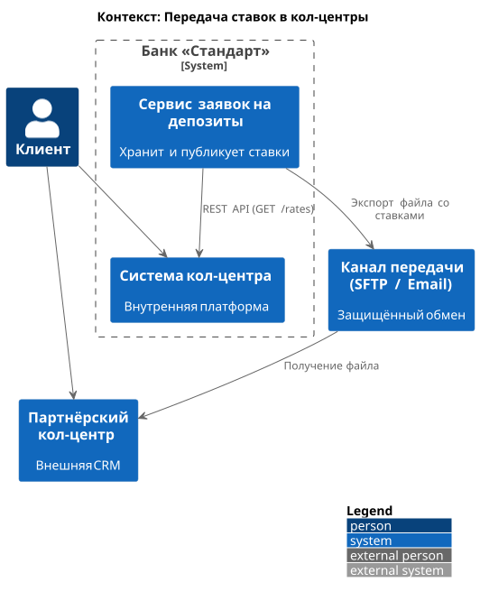
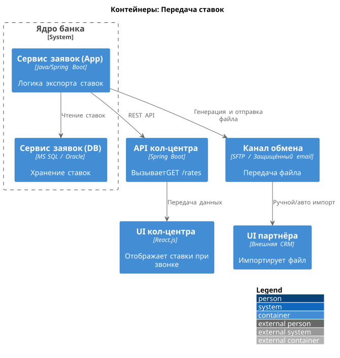

### **Название задачи:**  
Обеспечение доступа к актуальным депозитным ставкам для внутреннего и партнёрского кол-центров

### **Автор:**  
Архитектор цифровой трансформации

### **Дата:**  
29 января 2026 г.

### **Функциональные требования**

|**№**|**Действующие лица или системы**|**Use Case**|**Описание**|
| :-: | :- | :- | :- |
|1|Сотрудник внутреннего кол-центра|Получить актуальные ставки по депозитам|Видит список депозитов и ставок в интерфейсе своей системы при работе с клиентом.|
|2|Сотрудник партнёрского кол-центра|Получить актуальные ставки по депозитам|Использует внешнюю CRM; получает ставки из файла, предоставленного банком.|
|3|Система «Сервис заявок на депозиты»|Публиковать актуальные ставки|Формирует и выкладывает файл со ставками не реже 1 раза в день.|
|4|Система внутреннего кол-центра|Загружать ставки из центрального источника|Автоматически или вручную обновляет справочник ставок из API или файла.|
|5|Партнёрский кол-центр|Получать файл со ставками|Загружает файл по согласованному каналу (например, защищённая email-рассылка или SFTP).|

### **Нефункциональные требования**

|**№**|**Требование**|
| :-: | :- |
|1|Актуальность ставок: данные должны обновляться не реже 1 раза в сутки.|
|2|Формат передачи для партнёра - файл (CSV/JSON), без API-интеграции.|
|3|Передача данных должна быть защищена (шифрование при передаче и хранении).|
|4|Решение должно использовать существующие технологии и инфраструктуру банка.|
|5|Минимальное вмешательство в системы кол-центров (особенно партнёрского).|
|6|Файл со ставками должен содержать только публичную информацию (без персональных или конфиденциальных данных).|
|7|Процесс публикации ставок должен быть автоматизирован и логироваться.|

### **Решение**

### Обоснование
Текущий процесс хранения ставок в Excel-файлах ненадёжен и не масштабируем. В рамках MVP по открытию депозитов уже вводится **«Сервис заявок на депозиты»**, который будет хранить актуальные ставки в своей базе (MS SQL или Oracle).  

Мы предлагаем:
- Использовать этот сервис как **единственный источник правды** для ставок.
- Реализовать в нём **задачу экспорта** ставок в формате CSV/JSON.
- Для **внутреннего кол-центра** - предоставить REST API (GET /deposits/rates) с кэшированием.
- Для **партнёрского кол-центра** - генерировать зашифрованный файл и отправлять его по согласованному каналу (например, через защищённую email-рассылку или SFTP).

Это решение:
- Устраняет Excel-файлы,
- Минимизирует изменения в кол-центрах,
- Соответствует ограничениям партнёра,
- Использует уже разрабатываемый компонент.

### Диаграмма контекста

### Диаграмма контейнеров

### **Альтернативы**

| Вариант | Описание | Почему отклонён |
|--------|---------|------------------|
| **Прямая интеграция кол-центров с АБС** | Кол-центры читают ставки напрямую из АБС. | АБС перегружена; нет API; нарушает принцип изоляции бэк-офиса. |

**Недостатки, ограничения, риски**

1. **Задержка обновления** — ставки обновляются раз в сутки → клиент может получить устаревшую информацию утром.  

2. **Ручной импорт файла партнёром** — возможны задержки или ошибки.  

3. **Зависимость от нового сервиса** — если «Сервис заявок» недоступен, кол-центры не получат ставки.  

4. **Безопасность файла** — при передаче по email/SFTP требуется шифрование.  