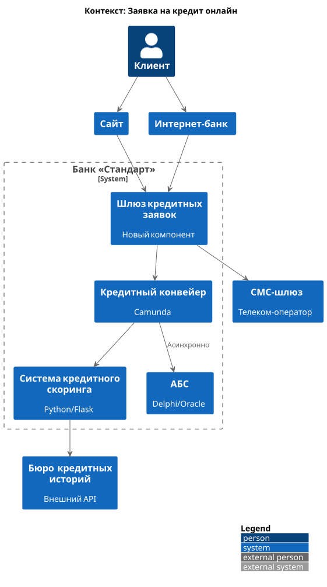
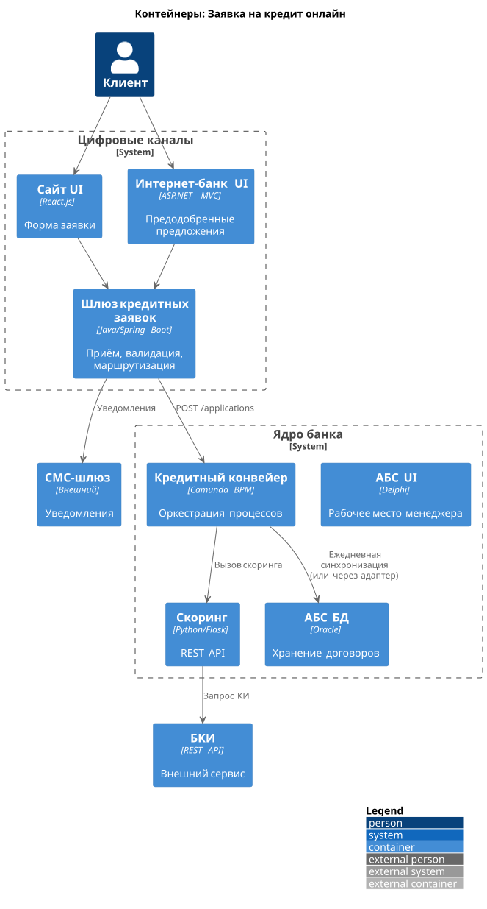

### **Название задачи:**  
Подача заявки на кредит онлайн через сайт и интернет-банк

### **Автор:**  
Архитектор цифровой трансформации

### **Дата:**  
29 января 2026 года

### **Функциональные требования**

|**№**|**Действующие лица или системы**|**Use Case**|**Описание**|
| :-: | :- | :- | :- |
|1|Клиент (новый)|Подать заявку на кредит через сайт с паспортными данными|Система запрашивает данные, вызывает скоринг на основе БКИ и выдаёт мгновенное решение.|
|2|Клиент (новый)|Подать упрощённую заявку на сайте (только ФИО + телефон)|Менеджер кол-центра звонит для уточнения условий; решение не выдаётся сразу.|
|3|Клиент (существующий)|Просмотреть предодобренное кредитное предложение в интернет-банке|Предложение основано на ранее выполненных скорингах.|
|4|Клиент (существующий)|Подать заявку на кредит в интернет-банке|Указывает сумму, срок, подтверждает СМС-кодом; запускается упрощённый скоринг.|
|5|Система|Отправить SMS о статусе заявки|Клиент получает уведомления: «заявка принята», «одобрена», «приходите в отделение».|
|6|Сотрудник отделения|Продолжить работу с онлайн-заявкой|Если клиент приходит в отделение - используется та же заявка из АБС/Конвейера.|

### **Нефункциональные требования**

|**№**|**Требование**|
| :-: | :- |
|1|Все внешние каналы должны использовать TLS 1.2+ для защиты персональных данных.|
|2|Время отклика по операциям (загрузка условий, подача заявки) ≤ 1 секунда.|
|3|Системы должны быть доступны 99,9% времени (24/7).|
|4|Запрещена прямая интеграция с БД АБС - только через API или промежуточный слой.|
|5|Система кредитного скоринга не должна нагружаться предварительными расчётами без паспортных данных.|
|6|Новые компоненты должны использовать существующие технологии (Java, Spring Boot, MS SQL, Oracle, Python).|
|7|Интерфейсы должны соответствовать корпоративной дизайн-системе.|
|8|Должна быть обеспечена сквозная идентификация заявки между каналами.|
|9|Решение по новому клиенту должно формироваться только на основе данных из Бюро кредитных историй (БКИ).|

### **Решение**

#### Обоснование архитектурного подхода
Учитывая:
- Наличие **Кредитного конвейера** и **Системы скоринга**,
- Ограничения на нагрузку АБС,
- Требование мгновенного решения для новых клиентов,

мы предлагаем:
- Использовать **Кредитный конвейер** как центральный оркестратор кредитных заявок.
- Ввести **новый компонент - «Шлюз кредитных заявок»**, который будет:
  - Принимать заявки с сайта и интернет-банка,
  - Вызывать скоринг **только после ввода паспортных данных**,
  - Интегрироваться с Кредитным конвейером через его существующий REST API (Camunda),
  - Передавать заявки в АБС **асинхронно**, минуя прямую нагрузку на БД.

Это решение:
- Использует уже существующую экспертизу (Java/Spring Boot),
- Не нагружает АБС,
- Позволяет реализовать мгновенный скоринг для новых клиентов,
- Поддерживает предодобренные предложения для существующих.

### Диаграмма контекста 

### Диаграмма контейнеров 

### **Альтернативы**

| Вариант | Описание | Почему отклонён |
|--------|---------|------------------|
| **Прямой вызов скоринга из интернет-банка/сайта** | Цифровые каналы напрямую обращаются к системе скоринга. | Нарушает принцип централизованной оркестрации; дублирование логики; риск обхода бизнес-правил. |
| **Интеграция через АБС в реальном времени** | Все заявки пишутся сразу в АБС. | АБС не выдержит нагрузку; противоречит требованию изоляции. |
| **Отказ от мгновенного решения для новых клиентов** | Все заявки обрабатываются вручную. | Нарушает бизнес-цель: конкуренты предлагают предодобрение за минуты. |

**Ограничения решения**

1. **Скоринг для новых клиентов ограничен данными БКИ** - менее точная оценка.  

2. **Зависимость от Кредитного конвейера** — если он недоступен, новые заявки не принимаются.  